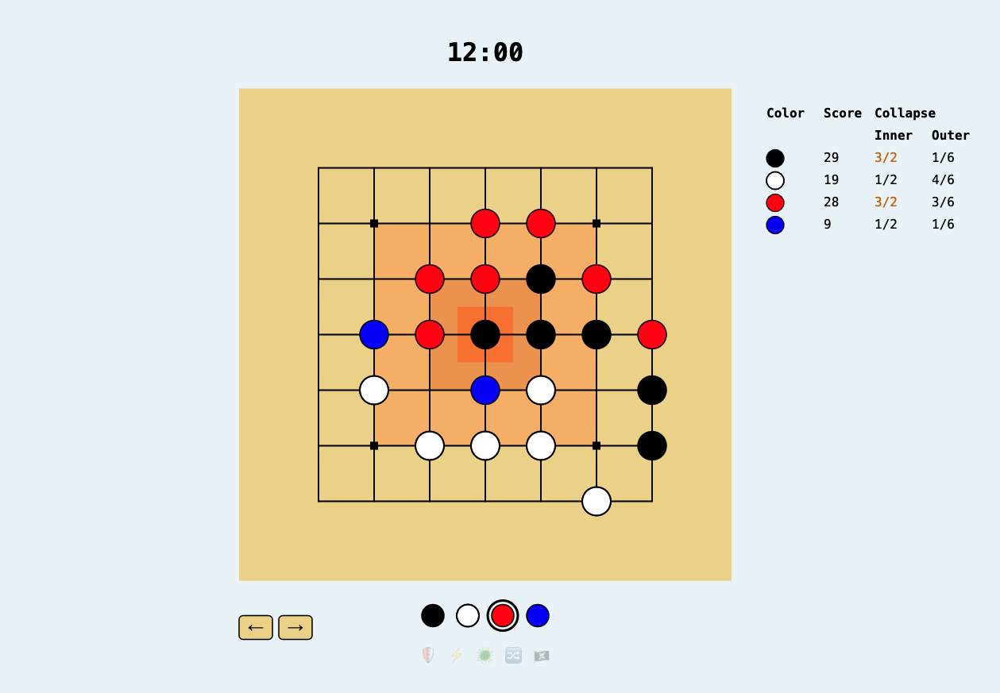

# Go: King of The Hill



[View this project online](https://p-hebert.github.io/cu-cart215/) -->

**Go: King of The Hill** is a 4-player semi-cooperative strategy game inspired by **Go**, redesigned around territorial pressure, rubber-banding powers, and a shared collapse condition.

Players compete to score points by occupying valuable intersections near the center of the board. However, if any player over-concentrates too much influence in the most valuable regions, the board collapses and everyone loses.

This project was created for **CART 215 – Introduction to Game Design** as a digital prototype of a tabletop game design assignment.

# Table of Contents

- [Go: King of The Hill](#go-king-of-the-hill)
- [Table of Contents](#table-of-contents)
  - [Project Overview](#project-overview)
  - [Design Goals](#design-goals)
    - [DEPRECATION NOTICE](#deprecation-notice)
  - [Core Rules](#core-rules)
    - [Players](#players)
    - [Board](#board)
    - [Turn Structure](#turn-structure)
    - [Scoring](#scoring)
    - [Captures](#captures)
    - [Collapse](#collapse)
  - [Rubber-Banding Actions](#rubber-banding-actions)
    - [Shield](#shield)
    - [Scar](#scar)
    - [Spread](#spread)
    - [Switch](#switch)
    - [Assimilate](#assimilate)
  - [Player Experience](#player-experience)
  - [Implementation Highlights](#implementation-highlights)
  - [Known Issues](#known-issues)
  - [Future Improvements](#future-improvements)
  - [Structure of the Code](#structure-of-the-code)
  - [Running the Project](#running-the-project)
  - [Attribution \& GenAI](#attribution--genai)
    - [Assets](#assets)
    - [Generative AI Usage](#generative-ai-usage)
  - [License](#license)

## Project Overview

**Go: King of The Hill** began as an attempt to combine several assigned game design mechanisms into one cohesive game:

- Semi-cooperative game structure
- King of the Hill scoring
- Elapsed real time
- Prisoner’s Dilemma pressure
- Probability / risk management
- Special player actions

The final result is a compact digital board game prototype where each player wants to win individually, but everyone must avoid triggering collapse.

The prototype is implemented in **p5.js** using a custom lightweight scene/component architecture and a rule engine inspired by Go.

## Design Goals

The core design challenge was:

> How can a competitive abstract strategy game create shared tension without becoming purely cooperative?

The answer became the **collapse system**.

Players are rewarded for moving into the center, but the center is dangerous. The strongest moves are also the moves that bring the group closer to collective failure.

This creates a strategic tension:

```txt
I want to score.
I want to block other players.
I want to avoid collapse.
I may want other players to think I am not responsible for the danger.
```

The game is meant to produce table discussion, suspicion, negotiation, opportunism, and moments of tactical betrayal.

### DEPRECATION NOTICE

This mechanic is scheduled to be removed in later iterations.
Playtest experience showed that the Collapse system does not alter player behaviour, which is primarily competitive-oriented, and the additional constraint does not add fun or immersion to the gameplay. As such it will be replaced by a hard cap on player domination of each ring to ensure better balance.

## Core Rules

### Players

The game supports four players:

- Black
- White
- Red
- Blue

Each player takes turns placing stones on the board.

### Board

The game is played on a **7×7 Go-style grid**.

Stones are placed on intersections, not inside squares.

The board has multiple scoring regions:

- Outer ring: low value
- Middle ring: medium value
- Inner ring: high value
- Center: highest pressure point / special point

### Turn Structure

On your turn, you normally place one stone of your color on an empty intersection.

Alternatively, if available, you may use one special action.

After a player uses an action, they enter cooldown and cannot use another action on their next turn.

### Scoring

Players score based on the intersections occupied by their stones.

The scoring system rewards movement toward the center:

```txt
Outer region: low score
Middle region: medium score
Inner region: high score
Center: special / highest-value location
```

Scar stones do not score for any player.

### Captures

Capture rules are based on Go:

- Orthogonally connected stones form groups.
- A group survives if it has at least one liberty.
- A liberty is an empty orthogonally adjacent intersection.
- If a group has no liberties, its capturable stones are removed.

The prototype also supports special exceptions:

- Shielded stones survive capture.
- Scar stones are uncapturable while active.
- Scar stones participate in capture as hostile blockers controlled by the player who created them.

### Collapse

Collapse is the shared-loss pressure system.

Each player has a limit on how many stones they can safely hold in the most valuable regions.

If a player exceeds the safe limit too severely, the board collapses and all players lose.

## Rubber-Banding Actions

Special actions become available when a player falls behind the leading score.

These actions are intended to prevent runaway leaders and give trailing players meaningful tactical options.

The top-scoring player cannot use rubber-banding actions.

### Shield

**Shield** protects one of your stones from capture until the end of your next turn.

Only the shielded stone is protected. If its group is captured, the rest of the group is removed normally, but the shielded stone remains.

This gives the trailing player a way to anchor a fragile position without making an entire group invulnerable.

### Scar

**Scar** replaces a higher-scoring player’s stone with a temporary grey blocker.

A Scar:

- Is visually grey
- Does not score
- Is uncapturable while active
- Acts as a hostile blocker for capture purposes
- Is removed at the start of the creator’s second turn after creation

Scar is meant to create disruption without permanently stealing ownership.

### Spread

**Spread** allows a player to place two stones on 1-point or 3-point intersections.

Both stones are placed as part of one action.

This gives trailing players a way to rebuild board presence quickly, but limits them to lower- or medium-value spaces.

### Switch

**Switch** swaps one of your stones with a higher-scoring player’s non-center stone.

This action requires:

- One of your own stones on the board
- A target stone belonging to a higher-scoring player
- The target cannot be on the center intersection
- The target cannot be a Scar

Captures are resolved after the swap.

Switch is designed to reposition a trailing player into a stronger region while displacing a leader.

### Assimilate

**Assimilate** converts a higher-scoring player’s stone to your color if it is adjacent to one of your groups of size two or more.

This is not simply “two adjacent stones.” The target must touch a connected group of at least two stones controlled by the current player.

Assimilate rewards players for building small formations and then expanding through enemy positions.

## Player Experience

The intended player experience is a mix of:

- Abstract tactical play
- Spatial pressure
- Rubber-banding comeback moments
- Shared-risk negotiation
- Opportunistic betrayal
- Tension around collapse

The game asks players to compete for the most valuable spaces while also policing one another’s overreach.

The ideal table conversation sounds something like:

```txt
“You’re about to collapse the board.”
“I’m not collapsing it, I’m catching up.”
“If you go there, everyone loses.”
“Unless someone scars you first.”
```

## Implementation Highlights

This prototype includes:

- A custom p5.js scene/runtime structure
- Reusable drawable UI components
- Board rendering with hover previews
- Go-inspired capture logic
- Multi-player turn cycling
- Undo/redo snapshots
- Score tracking
- Collapse tracking
- Countdown timer
- Action cooldown UI
- Tooltip popovers for action explanations
- Toast-style notifications for illegal moves/actions
- Special action system:
  - Shield
  - Scar
  - Spread
  - Switch
  - Assimilate

The implementation gradually evolved from a simple board editor into a small game engine with explicit state, rules, UI components, and action logic.

## Known Issues

This prototype is ready for playtesting, but some issues remain.

**Collapse legality**

Collapse-causing moves are intended to be illegal. The current implementation does not reliably block collapse-causing moves before placement in every case.

For playtesting:

```txt
If a move creates immediate collapse, press Undo and treat the move as illegal.
```

**Action coupling**

Some actions are currently tightly coupled across the dependency chain:

```txt
GameScene
→ GameState
→ Action classes
→ GoBoardState
→ GoRulesHelper
→ StoneData
```

This works for the prototype, but a future version should introduce a cleaner effect system.

**Stone effects**

Stone effects are currently represented through direct fields such as:

```txt
capturable
shieldedByColorName
scarCreatedByColorName
expiresOnTurnNumber
```

A more scalable future version would store explicit effects on stones, for example:

```txt
stone.effects = [
  { type: "shield", owner: "black", expiresOnTurnNumber: 8 },
  { type: "scar", owner: "blood-red", expiresOnTurnNumber: 12 }
]
```

**Color constants**

The project currently contains more than one stone/player color definition. These should eventually be centralized into one shared module.

## Future Improvements

Possible future improvements include:

- Fully reliable collapse-move legality validation
- Cleaner stone effect architecture
- Centralized color definitions
- Better action preview feedback
- More explicit visual state for Shield and Scar
- End-of-game screen
- Better onboarding/tutorial flow
- AI or scripted playtest tools
- Networked multiplayer
- Port to Unity for a more complete portfolio version
- Additional juice/animation for captures and action effects

## Structure of the Code

```txt
src
├── components
│   ├── action-button.mjs              # Emoji action button with tooltip popover
│   ├── board.mjs                      # Board rendering and coordinate conversion
│   ├── button.mjs                     # Generic button component
│   ├── countdown-timer.mjs            # 10-minute playtest timer
│   ├── history-button-group.mjs       # Undo/redo UI
│   ├── notification-toast.mjs         # Top-of-canvas player feedback notifications
│   ├── score-tracker.mjs              # Score and collapse display
│   ├── stone-button.mjs               # Player stone selector button
│   ├── stone-selector.mjs             # Current player/action selector UI
│   └── stone.mjs                      # Stone rendering helper/component
├── engine
│   ├── action-availability-helper.mjs # Determines which actions are enabled
│   ├── actions.mjs                    # Shield, Scar, Spread, Switch, Assimilate
│   ├── collapse-rules-helper.mjs      # Collapse threshold calculations
│   ├── game-state.mjs                 # Main gameplay state and turn system
│   ├── go-board-state.mjs             # Board state wrapper
│   ├── go-rules-helper.mjs            # Go-style legality, liberties, captures
│   ├── points.mjs                     # Board point values
│   ├── score-calculator.mjs           # Score calculation
│   └── stone-data.mjs                 # Runtime stone data
├── p5
│   ├── components
│   │   └── input.mjs                  # Input helpers
│   ├── global.mjs                     # p5 globals / shared setup
│   ├── interfaces.mjs                 # p5 lifecycle interfaces
│   ├── runtime.mjs                    # p5 runtime and scene manager
│   └── scene.mjs                      # Base scene class
├── scenes
│   ├── game.mjs                       # Main game scene
│   ├── loading.mjs                    # Loading scene
│   └── menu.mjs                       # Menu scene
├── utils
│   ├── fonts.mjs                      # Font loading utilities
│   └── loading-tracker.mjs            # Loading progress helper
├── main.mjs                           # Application entrypoint
└── resources.mjs                      # Resource registration
```

## Running the Project

This project uses Vite and p5.js.

Install dependencies:

```bash
npm install
```

Run the development server:

```bash
npm run dev
```

Build for production:

```bash
npm run build
```

Preview the production build:

```bash
npm run preview
```

If this repository uses a Makefile, the preferred commands may be:

```bash
make install
make dev
make build
```

## Attribution & GenAI

### Assets

This project currently uses minimal visual assets. Most visuals are procedurally drawn with p5.js.

If screenshots, fonts, sounds, or additional visual assets are added later, their source and license should be documented here.

### Generative AI Usage

This project was developed with substantial assistance from generative AI, especially for:

- Architecture planning
- Rule implementation
- Refactoring suggestions
- p5.js UI components
- Undo/redo state handling
- Action system implementation
- README drafting

The game design direction, rule decisions, balancing judgments, and final integration choices were made by the author.

Approximate GenAI contribution by area:

```txt
src
├── components                          100%
│   ├── action-button.mjs               100%
│   ├── board.mjs                       100%
│   ├── button.mjs                      100%
│   ├── countdown-timer.mjs             100%
│   ├── history-button-group.mjs        100%
│   ├── notification-toast.mjs          100%
│   ├── score-tracker.mjs               100%
│   ├── stone-button.mjs                100%
│   ├── stone-selector.mjs              100%
│   └── stone.mjs                       100%
├── engine                              100%
│   ├── action-availability-helper.mjs  100%
│   ├── actions.mjs                     100%
│   ├── collapse-rules-helper.mjs       100%
│   ├── game-state.mjs                  100%
│   ├── go-board-state.mjs              100%
│   ├── go-rules-helper.mjs             100%
│   ├── points.mjs                      100%
│   ├── score-calculator.mjs            100%
│   └── stone-data.mjs                  100%
├── p5                                  0%
│   [Original from p-hebert/cu-cart253/projects/variation-jam]
│   ├── components/input.mjs            0%
│   ├── global.mjs                      0%
│   ├── interfaces.mjs                  0%
│   ├── runtime.mjs                     0%
│   └── scene.mjs                       0%
├── scenes                              70%
│   [Original from p-hebert/cu-cart253/projects/variation-jam]
│   ├── game.mjs                        100%
│   ├── loading.mjs                     0%
│   └── menu.mjs                        0%
└── utils                               0%
    [Original from p-hebert/cu-cart253/projects/variation-jam]
    ├── fonts.mjs                       0%
    └── loading-tracker.mjs             0%
```

## License

This project is licensed under the **Creative Commons Attribution 4.0 International Public License**, available in [LICENSE.md](./LICENSE.md).
